# admin-vue

基于Vue3+SpringBoot3的企业级管理系统前端项目，提供完整的用户权限管理和业务数据管理功能。

## 📋 项目简介

这是一个现代化的企业级管理系统前端，采用Vue3 + Element Plus构建，实现了用户认证、权限控制、数据统计、部门管理、文章管理、员工管理等核心功能。系统界面美观、交互友好，适用于中小型企业的日常管理需求。

## 🛠 技术栈

- **前端框架**: Vue 3
- **UI组件库**: Element Plus
- **状态管理**: Pinia
- **路由管理**: Vue Router 4
- **HTTP客户端**: Axios
- **图表库**: ECharts
- **富文本编辑器**: WangEditor
- **构建工具**: Vite
- **认证**: JWT Token

## 🚀 快速开始

### 环境要求

- Node.js ^20.19.0 || >=22.12.0
- npm 或 yarn

### 安装依赖

```sh
npm install
```

### 开发环境运行

```sh
npm run dev
```

### 生产环境构建

```sh
npm run build
```

### 预览构建结果

```sh
npm run preview
```

## 📁 项目结构

```
src/
├── assets/         # 静态资源
├── components/     # 公共组件
├── router/         # 路由配置
├── stores/         # 状态管理
├── utils/          # 工具函数
└── views/          # 页面组件
```

## ✨ 功能模块

### 🔐 用户认证

- **用户注册**: 新用户注册功能，支持基本信息填写
  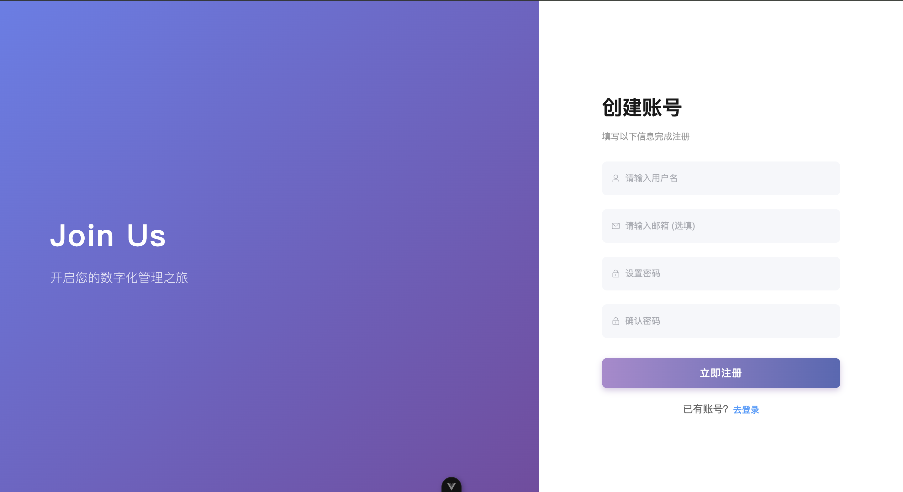
- **用户登录**: 支持用户名/邮箱登录，JWT Token认证
  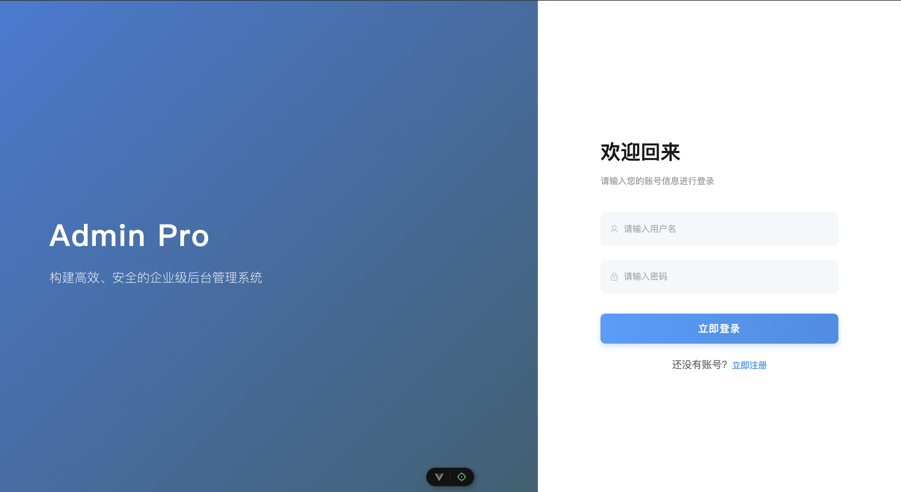
- **密码修改**: 用户可自行修改登录密码
  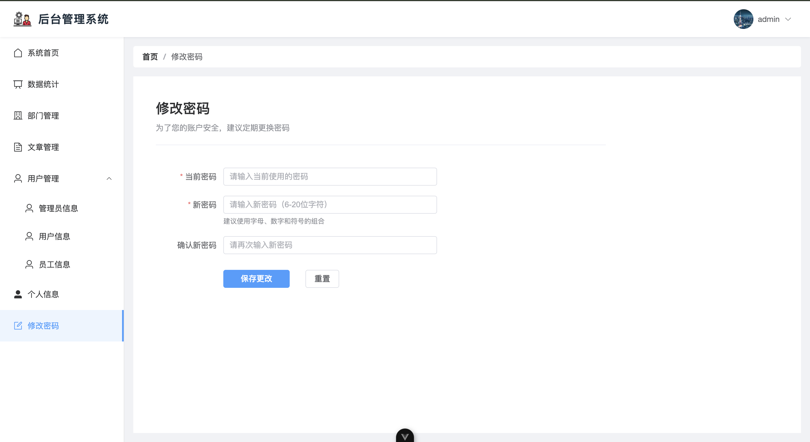

### 📊 数据统计

- **数据概览**: 提供系统关键数据统计和可视化图表
  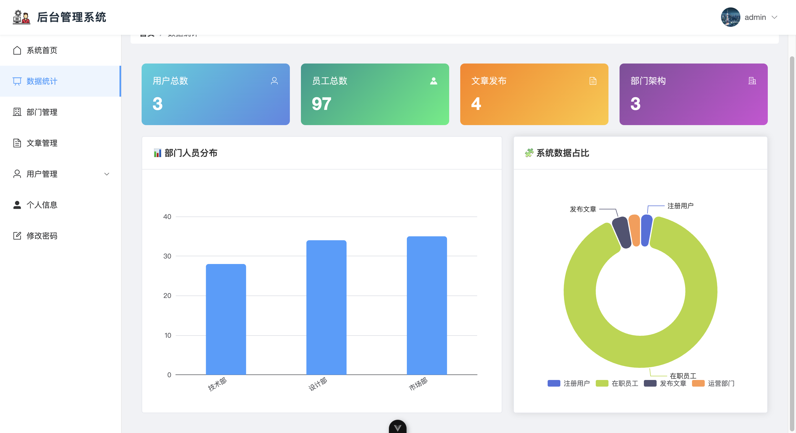

### 👥 用户管理

- **用户列表**: 查看所有用户信息，支持搜索和分页
  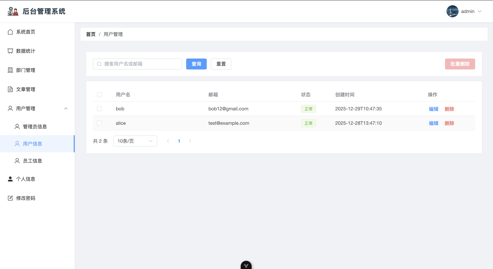
- **用户编辑**: 编辑用户基本信息和权限
  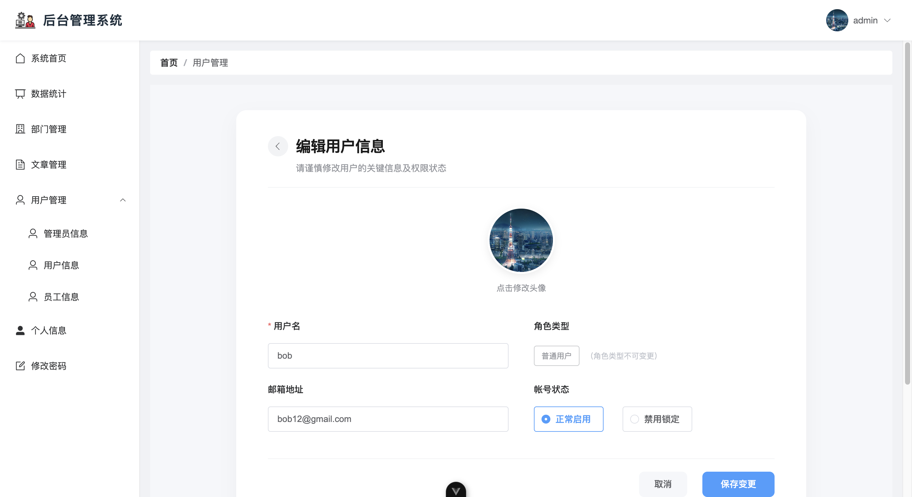

### 🏢 部门管理

- **部门列表**: 管理企业部门结构
  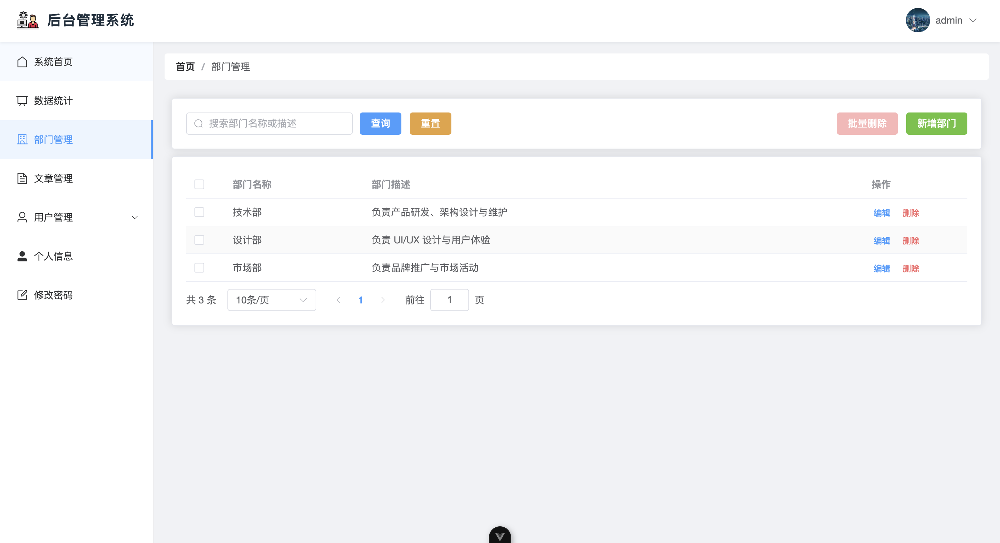
- **新增部门**: 创建新的部门
  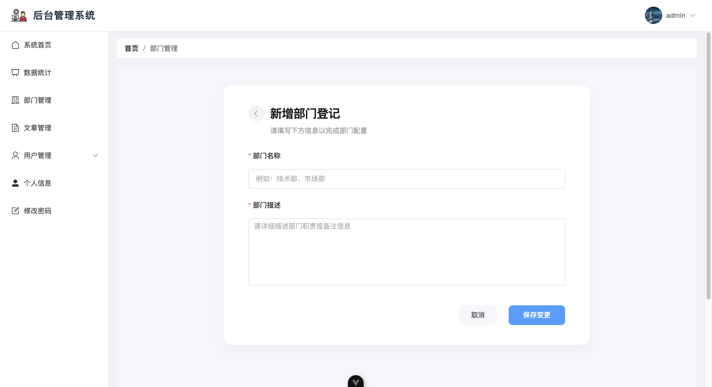

### 👤 员工管理

- **员工列表**: 管理员工基本信息
  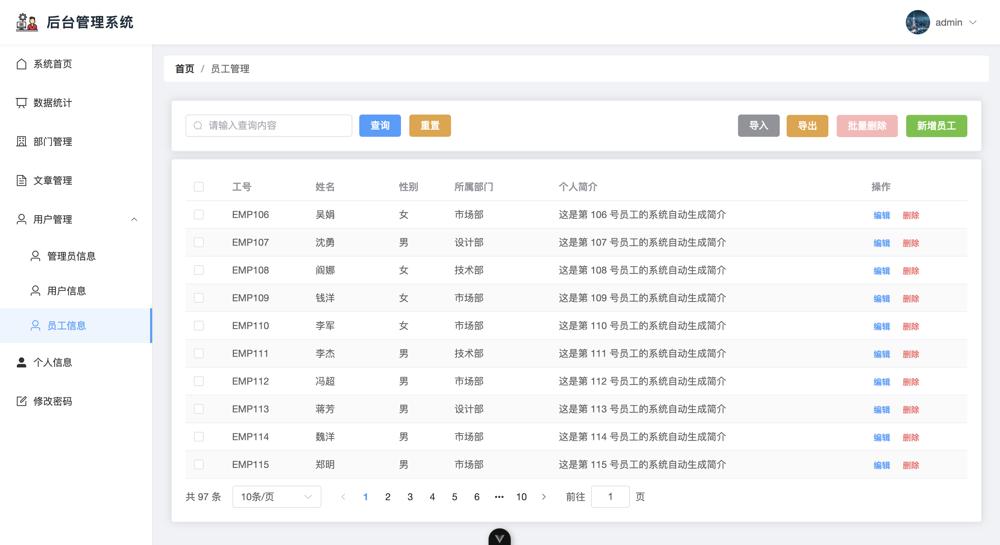
- **员工编辑**: 编辑员工详细信息
  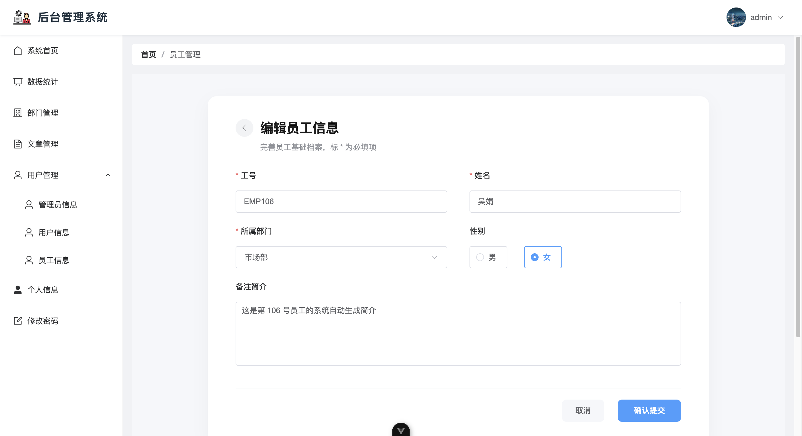

### 📝 文章管理

- **文章列表**: 管理和发布文章内容
  
- **新增文章**: 创建和发布新文章
  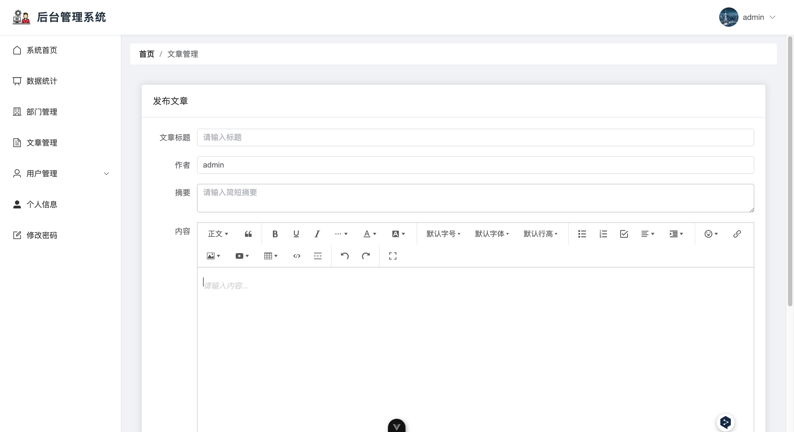
- **文章预览**: 预览文章内容和格式
  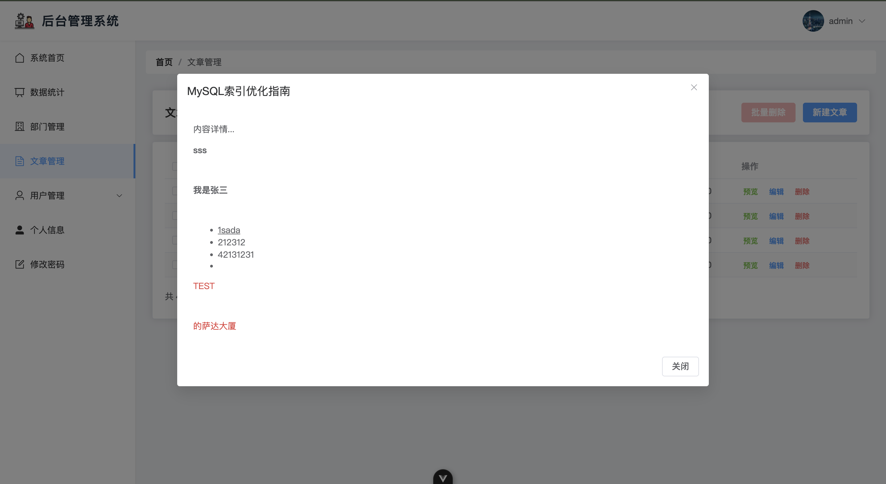

### ℹ️ 个人中心

- **个人信息**: 查看和编辑个人资料
  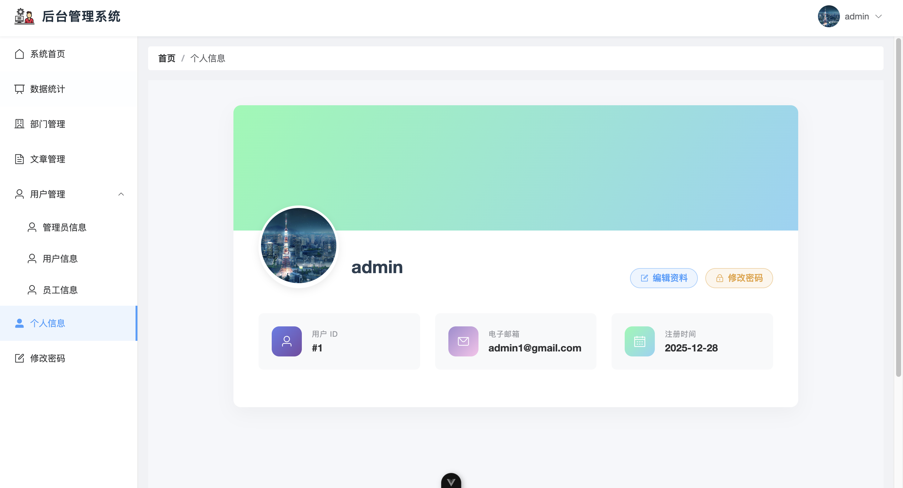
- **信息编辑**: 更新个人详细信息
  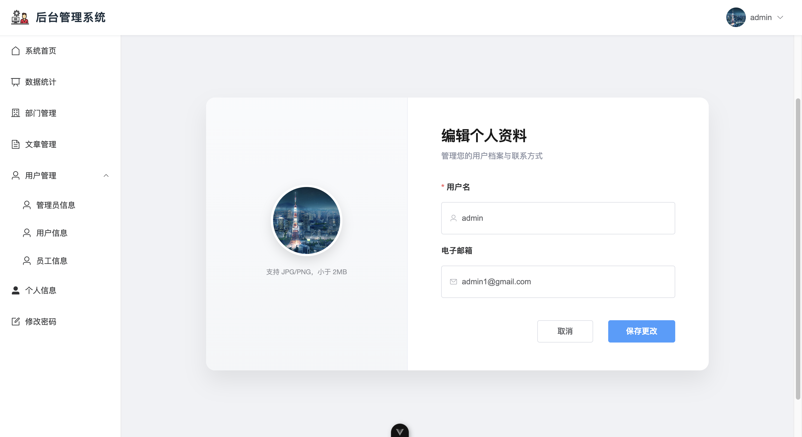

### 🎯 管理后台

- **管理首页**: 系统管理主界面
  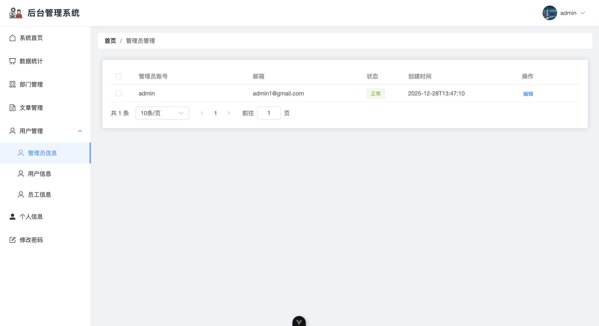
- **系统首页**: 用户登录后的首页展示
  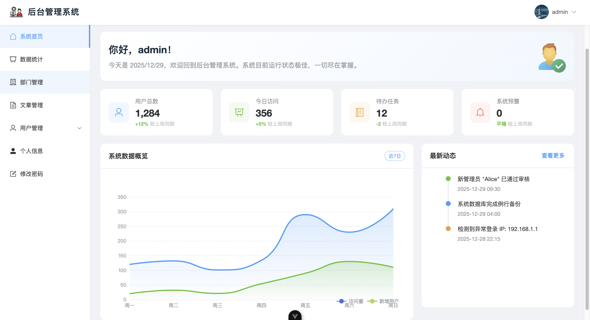

## 🔐 权限控制

系统实现了基于角色的权限控制：

- **普通用户**: 可访问个人信息、密码修改等基础功能
- **管理员**: 拥有所有模块的访问和管理权限

## 🌐 后端项目

配套的后端项目地址：[admin-backend](https://github.com/zichuanxu/admin-backend)

## 🤝 贡献指南

欢迎提交Issue和Pull Request来改进项目。

## 📄 许可证

本项目基于 [LICENSE](./LICENSE) 协议开源。
